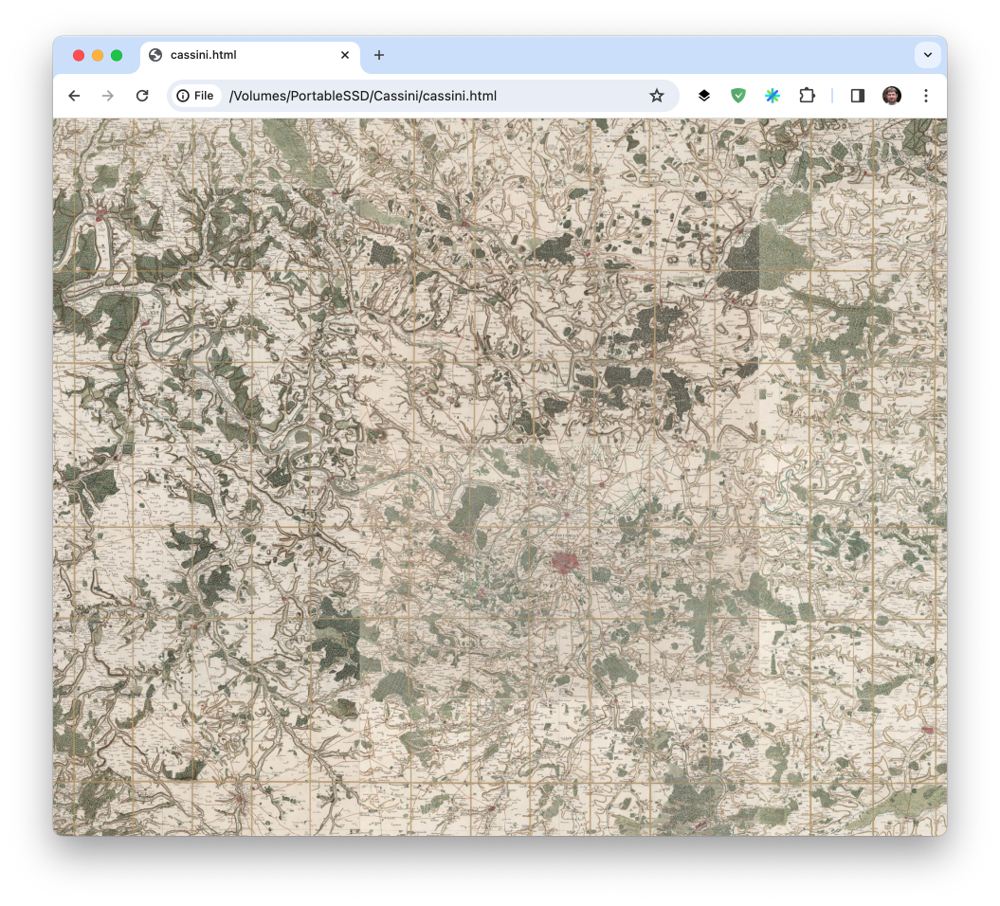

  # **Khufu** is a very simple HTTP server that serves tiles from  **single pyramidal TIFF files** 

This allows gigantic TIFF files to be deployed locally or over the Web, without the hassle 
of generating a Deep Zoom file hierarchy and having a web server deliver it.

When you have terapixel images, with dimensions up to 4 267 800 x 2 086 480 pixels (as from https://github.com/delhoume/BigMars), 
even with a 512x512 tile size you end up having 5558 x 3705 jpeg files (that makes more than 2 million files for the most detailed level).

You deploy then using a DZI file that describes the image and it can be visualized in a web browser,
with a web server serving the tiles, and an OpenSeaDragon javascript object in an HTML page.

**Khufu** allows tiles to be be served from a single TIFF file that has the same structure as a DeepZoom image.

Thanks to the wonderful OpenSeaDragon project, all you have to do is use a Custom Embedded Source in an HTML
page, run the **khufu** Web Server where your images are, and they become instantly viewable, whatever their pixel dimensions and disk size.

  1. Create an HTML file that defines a custom tile source for OpenSeaDragon

````
<meta name="viewport" content="width=device-width, initial-scale=1.0, maximum-scale=1.0">
<style>
#openseadragon1 { width: 100vw; height: 100vh; }
body { margin: 0; padding: 0; }
</style>

<div id="openseadragon"></div>
<script src="openseadragon.min.js"></script>
<script type="text/javascript">
const SERVER = "http://0.0.0.0:8000";
var viewer = OpenSeadragon({
  id: "openseadragon",
  prefixUrl: "https://cdn.jsdelivr.net/npm/openseadragon@3.1.0/build/openseadragon/images/",
  tileSources: {
        overlay: 0,
        width:  189680,
        height: 189680,
        tileSize: 512,
        minLevel: 9,
        maxLevel: 18
        getTileUrl: function( level, x, y ) {
            return SERVER + "/tile/"  + mars_4_4 + "/" + (18 - level) + "/" + x + "/" + y;
        },
    //  debugMode: true
}});
</script>
````
  2. Launch the **khufu** server 

```bin/khufu```

  3. open the HTML file in any Web Browser with Javascript support to explore your image.

You may have to update the SERVER variable in the HTML depending on your configuration.
You will also need the ```openseadragon.min.js``` file.

You can generate this HTML from a template for a given pyramidal TIFF (for example ```mars_4_4.tif```)
```scripts/tiff2khufu.sh mars_4_4.tif```

Khufu is built with the great Mongoose library https://mongoose.ws/ (two files and you have a web server !),
Libtiff (https://libtiff.gitlab.io/libtiff/#) LibJPEG (https://en.wikipedia.org/wiki/Libjpeg) and STB (https://github.com/nothings/stb/blob/master/stb_image_write.h).
Web client visualization provided by the fantastic OpenSeadragon project (https://openseadragon.github.io/)

The source code for both the server ```src/khufu.cpp``` and the sed parameter generator ```src/tiff2khufu.cpp``` is very simple.

I develop on a Mac Mini 2020  with Homebrew to fetch dependencies. Go to https://brew.sh, follow instructions to install, go to the khufu directory then type:
```
brew install gcc libtiff jpeg-turbo zlib-ng zstd lzma
make
```

and you are ready to go



**Khufu** in action on a 105342 x 193424 image made from 47 scanned pages taken from https://gallica.bnf.fr/ark:/12148/btv1b531569998/f7.item, processed,
geo-localized, stitched and rendered as single 5 Gigabyte TIFF

[https://www.youtube.com/shorts/ZZLwF6EcVjs](https://www.youtube.com/shorts/ZZLwF6EcVjs)
[https://www.youtube.com/shorts/gKuOutmZoD8](https://www.youtube.com/shorts/gKuOutmZoD8)


  ## Misc

Tiles are retireved from the TIFF file, decoded on the fly (libTIFF) and encoded (libJPEG or STB), there is no intermediary file.
It is very fast, especially thanks to the libturbo-jpeg and zlib-ng optimized implementations of libJPEG and zlib.


The protocol for serving is very simple, the complete request is encoded in the URI as: ```/tile/<name>/<level>/<col>/<row>```

```http://127.0.0.1:8000/tile/cassini/0/0/0``` will retrieve the top-left tile of the first directory of the cassini.tif image

khufu retrieves tile at col and row of the given level (directory in TIFF jargon, starting from 0) and returns a Jpeg file, 
so all levels or row/column mappings have to be computed in the OpenSeaDragon config in the HTML.

This is usually very simple, ```tiff2khufu``` handles most common cases (full resolution sub-image is first or last).
Other mappings can be implemented with a simple look-up table in the Javascript.

For an alternative to khufu, you can use my **Vliv** viewer for pyramidal TIFFs, for Windows.

https://github.com/delhoume/vliv

Compiling **khufu** on Windows with msvc is straightforward, once you got the dependencies.

This is working for me:

```cl /MD src/khufu.cpp src/mongoose.c  /Isrc /Isrc/tiff-4.3.0/libtiff /Isrc/zlib-1.2.11 /Isrc/libjpeg-turbo2.1.2/include  src/libs64/zlib.lib src/libs64/libtiff.lib src/libs64/turbojpeg-static.lib src/libs64/libwebp.lib```


